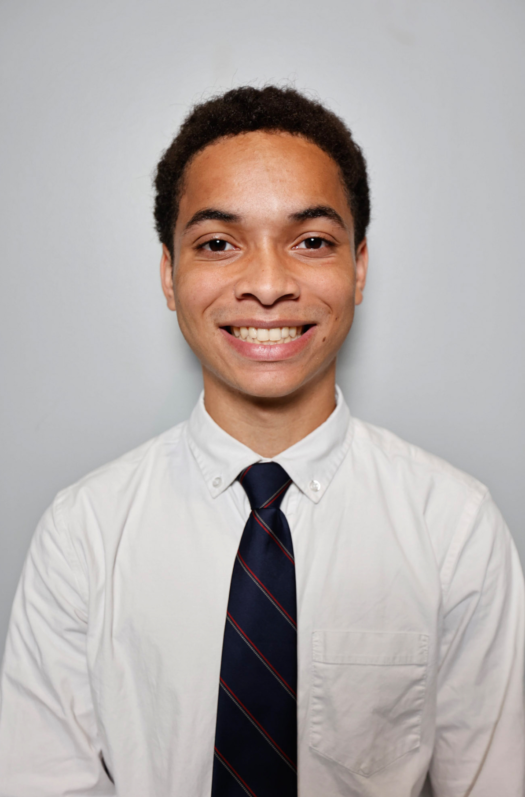

# Virtual Reality Portfolio — Jalen Edusei

<p align="center">
  
</p>

**Jalen Edusei**  
*Computer Systems Engineering Student, University of Georgia*  
📧 jalen.edusei@uga.edu  
🔗 [LinkedIn](https://www.linkedin.com/in/jalenedusei) • [GitHub](https://github.com/jke48222)

This portfolio demonstrates core concepts in Unity VR development through four interactive demos: 3D transformations, physics simulation, VR immersion, and puzzle-based interaction.

---

## Demos Overview

| Demo | Title | Description |
|------|--------|-------------|
| [Demo 1](Demo1_Transformation/README.md) | Solar System Simulation | Demonstrates 3D transformations, hierarchies, and lighting. |
| [Demo 2](Demo2_Physics/README.md) | Rube Goldberg Physics Machine | A chain-reaction physics scene using rigidbodies and joints. |
| [Demo 3](Demo3_Immersion/README.md) | Basic VR Exergame | A VR rhythm game focused on motion tracking and interaction. |
| [Demo 4](Demo4_Interaction/README.md) | Interactive Puzzle Game | A potion-mixing VR puzzle using advanced grabbing and triggers. |

---

**Unity Version:** 6000.0.57f1  
**XR Runtime:** OpenXR  
**Repository Structure:**  
```
VR-Portfolio-1/
│
├── Demo1_Transformation/
├── Demo2_Physics/
├── Demo3_Immersion/
├── Demo4_Interaction/
├── PaperReviews/
└── README.md
```